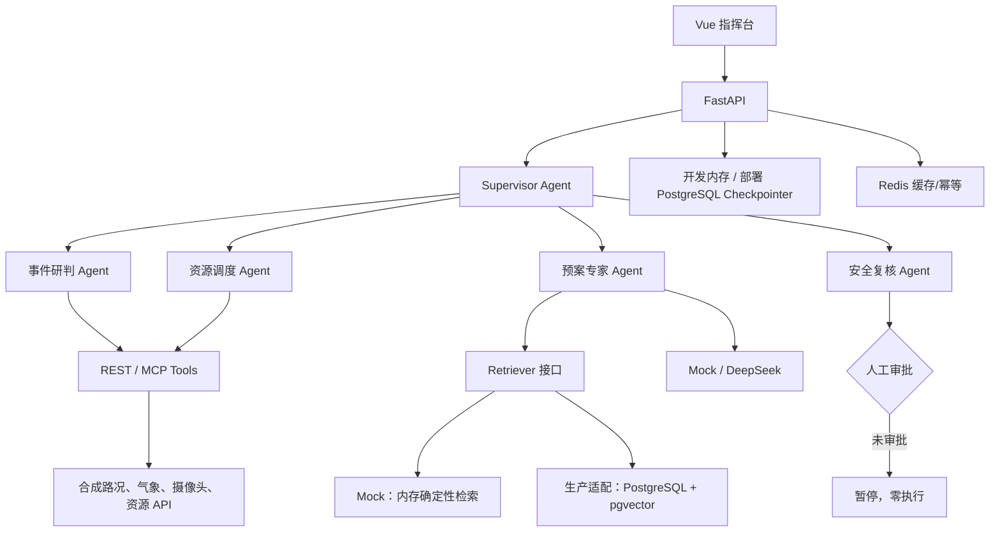

# 总体架构

```mermaid
flowchart TB
    UI["Vue 指挥台"] --> API["FastAPI"]
    API --> SUP["Supervisor Agent"]
    SUP --> IA["事件研判 Agent"]
    SUP --> PA["预案专家 Agent"]
    SUP --> RD["资源调度 Agent"]
    SUP --> SR["安全复核 Agent"]
    IA --> TOOLS["REST / MCP Tools"]
    RD --> TOOLS
    TOOLS --> MOCK["合成路况、气象、摄像头、资源 API"]
    PA --> RET["Retriever 接口"]
    RET --> MEM["Mock：内存确定性检索"]
    RET --> VEC["生产适配：PostgreSQL + pgvector"]
    PA --> DS["Mock / DeepSeek"]
    API --> CP["开发内存 / 部署 PostgreSQL Checkpointer"]
    API --> REDIS["Redis 缓存/幂等"]
    SR --> HITL{"人工审批"}
    HITL -- 未审批 --> STOP["暂停，零执行"]
```

固定工作流用于学习可控状态机；Supervisor 用于最终有界编排。两者都不能绕过安全复核和人工审批。所有路况、气象、摄像头和资源信息均为课程合成数据；Mock RAG 与生产 pgvector 适配边界在图中显式区分。
