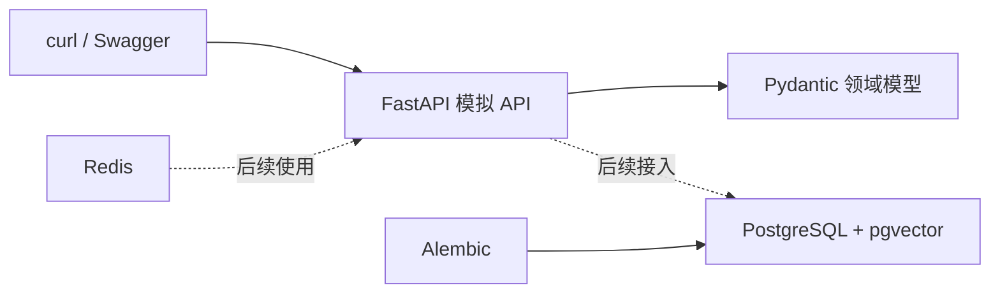
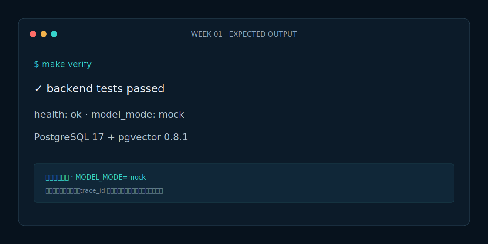

# Week 1 课程：先搭可靠底座，再写 Agent

## 1. 本周目标

完成可验证的领域模型、PostgreSQL/pgvector 本地环境和确定性模拟 API。理解为什么 Agent 不应直接依赖不稳定的外部响应。

## 2. 必要原理

Pydantic 负责输入输出契约，SQLAlchemy 描述持久化模型，Alembic 管理数据库版本。pgvector 与业务表共用 PostgreSQL，减少第一阶段部署复杂度。Redis 暂只作为后续缓存和幂等基础。

## 3. 架构图

## 4. 开发步骤

1. 安装 uv 并执行 `make setup`。
2. 阅读 `domain.py`，运行领域测试。
3. 执行 `make infra-up`，观察健康检查。
4. 执行 `make migrate` 创建 vector 扩展和表。
5. 启动 API，调用路况、天气和资源接口。
6. 使用 `X-Mock-Scenario: stale|unavailable` 触发确定性故障。
7. 执行 `make verify`。

## 5. 关键代码解释

`Incident` 使用枚举限制类型和状态；`road_code` 在模型入口统一大写。`PlanDocumentRecord.embedding` 使用固定 16 维教学向量，Week 2 再解释 Embedding。模拟接口的失败通过显式 Header 触发，不使用随机数，保证测试稳定。

## 6. 预期运行结果

`G65/QINLING-01` 返回拥堵、平均速度 22 km/h、关闭两条车道；气象接口返回模拟降雪橙色预警；资源接口能按类型筛选救护车或清障车。

## 7. 测试与评测

本周评测等同于契约测试：结构化输出必须 100% 合法，未知路段返回稳定错误码，Docker Compose 使用固定镜像标签并包含健康检查。

## 8. 常见错误

- `5432` 被占用：修改 Compose 端口或停止本机 PostgreSQL。
- Alembic 找不到包：必须从 `backend` 目录通过 uv 运行。
- API 数据看起来不真实：这是刻意设计的课程模拟数据。

## 9. 实战作业

增加 `G30/BAOJI-01` 路段、对应天气和两种救援资源，并为正常、未知路段和服务不可用各写一个测试。

## 10. 通关清单

- [ ] 能解释 Pydantic 模型与数据库模型的区别。
- [ ] 能启动 PostgreSQL/pgvector 和 Redis。
- [ ] Alembic 迁移成功。
- [ ] 三类模拟 API 可调用。
- [ ] `make verify` 通过。

## 11. 面试题

1. 为什么测试环境不随机制造 API 故障？
2. 为什么本项目选择 pgvector 而不是独立向量数据库？
3. Alembic 迁移与 SQLAlchemy Model 分别解决什么问题？

## 12. 下一周衔接

Week 2 使用本周的 `plan_documents` 表与稳定 Schema 构建第一个单工具预案专家 Agent。
