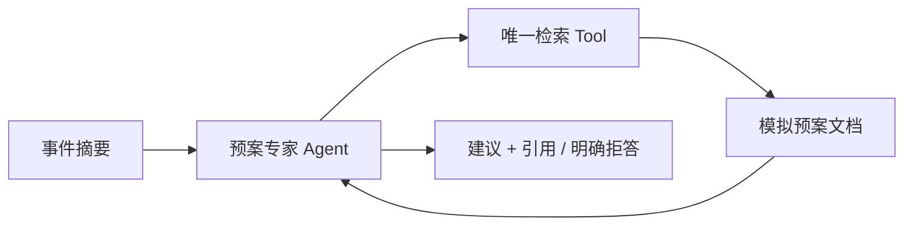
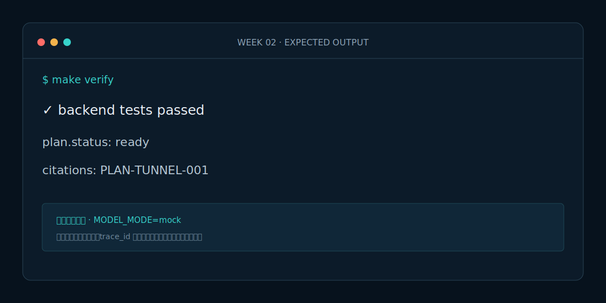

# Week 2 课程：第一个可解释的预案专家 Agent

## 1. 本周目标

实现“检索 → 判断证据 → 带引用回答”的单工具 Agent，理解 Agent 与固定 RAG Chain 的边界。

## 2. 必要原理

RAG 的可靠性来自证据边界，而不是更长 Prompt。课程先使用确定性中文二元组检索，保证测试可重复；Live 模式再把同一输入输出契约交给 DeepSeek。

## 3. 架构图

## 4. 开发步骤

1. 阅读 `rag.py` 的中文二元组与阈值。
2. 运行检索测试并观察排序。
3. 调用 `PlanExpertAgent.invoke`。
4. 输入无关问题验证 `insufficient_evidence`。
5. 阅读 `models.py` 的 DeepSeek 适配层。
6. 执行全量测试和评测。

## 5. 关键代码解释

Agent 不直接访问文档列表，而只依赖 Retriever。`Citation` 保存文档 ID、章节、来源和分数。DeepSeek 客户端关闭思考模式并请求 JSON 输出，Agent 业务代码不感知 HTTP 细节。

## 6. 预期运行结果

隧道烟雾事件返回 `ready`、四条建议和 `synthetic://plans/tunnel-incident` 引用；餐饮投诉返回 `insufficient_evidence` 且没有动作。

## 7. 测试与评测

覆盖检索排序、弱相关过滤、Embedding 稳定性、引用、拒答、API 以及 DeepSeek OpenAI-compatible 请求结构。

## 8. 常见错误

- 把模型常识当预案证据：必须拒答。
- 引用只有标题没有 source：无法审计。
- Live 测试直接联网：单元测试必须使用 MockTransport。

## 9. 实战作业

添加“危险品车辆事件”模拟预案，并让无危险品关键词的普通追尾不会误检该预案。

## 10. 通关清单

- [ ] 能解释检索阈值。
- [ ] 有证据时返回引用。
- [ ] 无证据时拒答。
- [ ] DeepSeek Key 不进入测试和日志。
- [ ] `make verify` 通过。

## 11. 面试题

1. 为什么 RAG 命中不等于回答正确？
2. 如何评测引用完整性？
3. Mock 模型和真实模型为什么必须实现相同契约？

## 12. 下一周衔接

Week 3 增加路况、气象和摄像头 Tool，并实现第二个事件研判 Agent。
