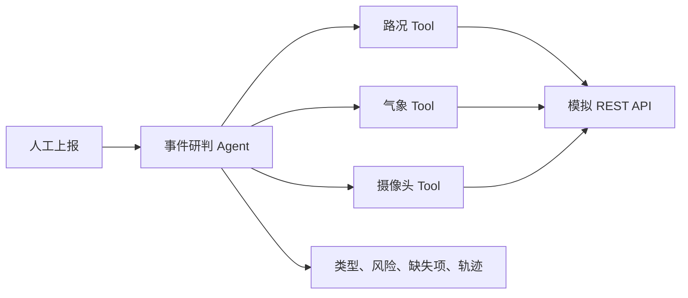
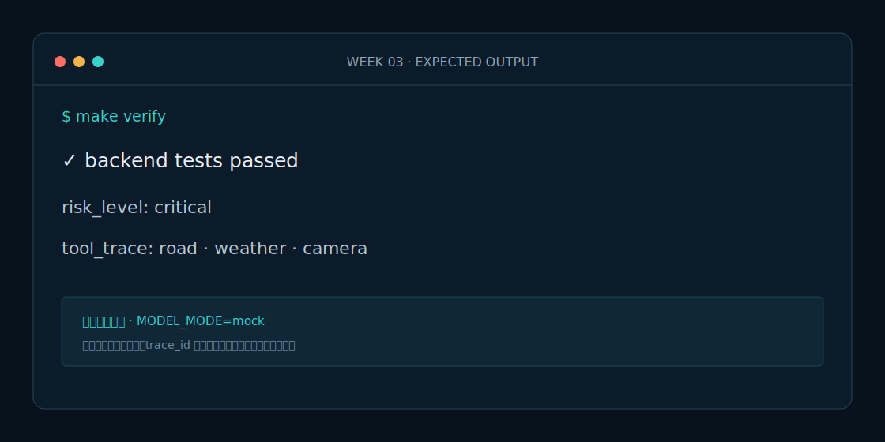

# Week 3 课程：让 Agent 可靠调用外部 API

## 1. 本周目标
掌握 HTTP Tool Schema、错误转换和可审计轨迹，实现事件研判 Agent。

## 2. 必要原理
Agent 不应直接处理 HTTP 细节；Tool Adapter 把状态码、超时和供应商错误转换为统一结果。未知信息必须进入 `missing_fields`，不能由模型补全。

## 3. 架构图

## 4. 开发步骤
先运行 Tool 测试，再观察成功与 unavailable 结果；调用 Agent；删除伤亡和车道描述观察缺失项；最后调用 API。

## 5. 关键代码解释
`ToolResult` 统一 data、error_code、source、observed_at 和 trace_id。Agent 最多调用三个只读 Tool，并使用确定性规则给出风险建议。

## 6. 预期运行结果

烟雾事件分类为 `tunnel_smoke`、风险为 `critical`，轨迹按路况、气象、摄像头排列。

## 7. 测试与评测
覆盖三个 Tool、显式服务失败、关键字段缺失、风险分类和 API 契约。

## 8. 常见错误
不要在 Agent 内拼 URL；不要用随机故障；不要把“未报告伤亡”改写成“无人伤亡”。

## 9. 实战作业
增加落石事件分类，并要求气象 Tool 失败时仍输出“需要人工核实天气”。

## 10. 通关清单
- [ ] 三个 Tool 可独立调用。
- [ ] 失败返回结构化错误。
- [ ] 未知事实进入 missing_fields。
- [ ] Tool 轨迹可追踪。
- [ ] `make verify` 通过。

## 11. 面试题
1. Tool Adapter 为什么不能只抛原始 HTTP 异常？
2. 如何防止 Agent 无限调用 Tool？
3. 未知信息和否定事实有什么区别？

## 12. 下一周衔接
Week 4 用 LangGraph 固定串联事件研判和预案专家，不引入 Supervisor。
