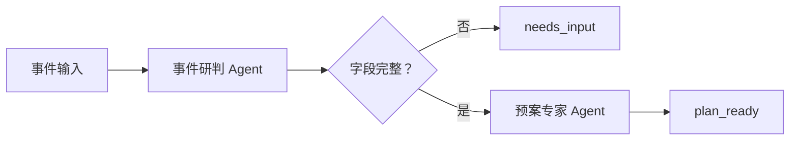
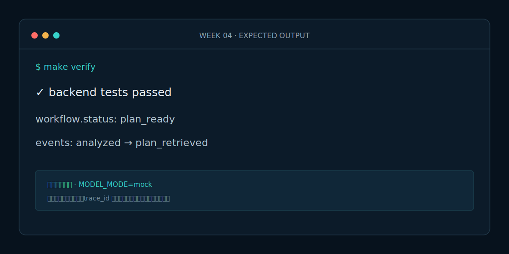

# Week 4 课程：双 Agent LangGraph 工作流

## 1. 本周目标

必做：理解 State、Node、Edge 和条件路由；把事件研判与预案专家串成固定图；保持两个 Agent 可独立测试。选做：在图中增加一个只记录耗时的观察节点。

## 2. 必要原理

LangGraph 负责保存状态和控制流，Agent 负责专业判断。固定工作流比自主规划更容易调试：先研判，信息不完整就停止；信息完整才检索预案。本周不做循环、不做 Supervisor。

## 3. 架构图

## 4. 开发步骤

1. 定义 `IncidentWorkflowState`。
2. 为研判、补充信息、检索预案分别建立节点。
3. 用条件边连接节点并编译图。
4. 暴露工作流 API，先跑单测再手工演示。

## 5. 关键代码解释

`_analyze_incident` 是异步节点；`_route_after_analysis` 只读取 `missing_fields`；`_retrieve_plan` 只在信息完整时运行。节点返回增量字典，Pydantic 结果先转换成可序列化数据，后续才能写入 Checkpoint。

## 6. 预期运行结果

完整案例：`秦岭隧道追尾出现烟雾，2人受伤，占用2车道`，路段 `G65/QINLING-01`。预期 `status=plan_ready`，事件顺序为 `incident_analyzed, plan_retrieved`，并包含预案引用。缺少伤亡描述时预期 `status=needs_input`。

## 7. 测试与评测

运行 `make test` 验证累计功能，运行 `make eval` 专测工作流分支。评测重点是节点顺序正确率 100%、缺失字段时误调用预案次数为 0。

## 8. 常见错误

- 在状态中保存 Pydantic 对象，导致 Checkpoint 无法序列化。
- 条件路由返回值与映射键不一致。
- 把专业判断写进图节点，造成 Agent 无法独立复用。

## 9. 实战作业

只做一个作业：新增“落石且伤亡未知”案例，断言工作流停在 `needs_input`，再补全输入并断言进入 `plan_ready`。

## 10. 通关清单

- [ ] 两个 Agent 可分别运行和测试。
- [ ] 工作流没有 Supervisor 和循环。
- [ ] 完整/缺失输入走不同分支。
- [ ] `make test/eval/verify` 全部通过。

## 11. 面试题

1. LangGraph State 与普通函数参数有什么区别？
2. 为什么 Agent 与工作流编排要分层？
3. 条件路由如何避免错误建议继续传播？

## 12. 下一周衔接

下一周在同一张图上加入 PostgreSQL Checkpoint、工作记忆与人工审批，使流程可以安全暂停和恢复。
