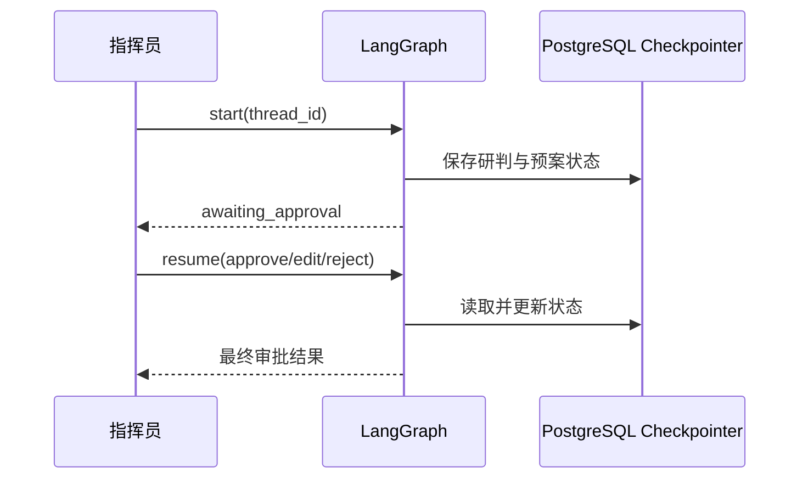
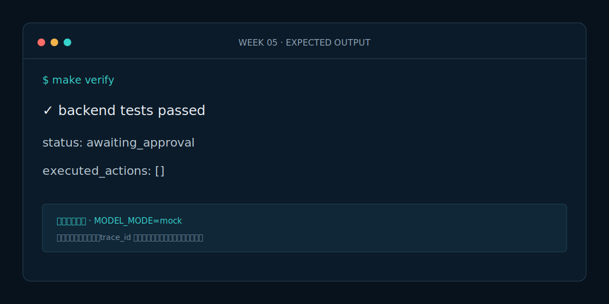

# Week 5 课程：Checkpoint、工作记忆与人工审批

## 1. 本周目标

必做：掌握线程状态、Checkpoint、暂停和恢复；实现人工审批；验证未审批高风险操作为 0。选做：查看 PostgreSQL 中的 Checkpoint 记录并解释版本变化。

## 2. 必要原理

工作记忆是一次事件线程中的状态，Checkpoint 是其可恢复快照。`interrupt` 返回待审批信息并暂停图；恢复时必须使用同一个 `thread_id`。开发内存存储便于测试，生产 PostgreSQL 才能跨进程恢复。

## 3. 架构图

## 4. 开发步骤

1. 给状态增加 `approval` 与 `executed_actions`。
2. 在预案节点之后增加 `human_approval`。
3. 编译图时注入 Checkpointer。
4. 实现 start/resume API，并测试三个决定。

## 5. 关键代码解释

`ApprovalEmergencyWorkflow.start` 把 LangGraph 的 `__interrupt__` 转换成稳定 API；`resume` 用 `Command` 恢复原线程。`postgres_checkpointer` 负责初始化表；业务节点不直接操作数据库。

## 6. 预期运行结果

完整案例第一次返回 `status=awaiting_approval` 且 `executed_actions=[]`。提交 reject 后状态为 `rejected`；提交 approve/edit 后只记录课程模拟动作，不连接真实交通控制系统。

## 7. 测试与评测

`make eval` 重点验证暂停前零执行、拒绝后零执行、恢复不重复运行前置节点。生产数据库练习执行 `make infra-up` 和 `make migrate`。

## 8. 常见错误

- start 和 resume 使用不同 `thread_id`。
- 忘记给编译后的图注入 Checkpointer。
- 把审批状态存在进程全局变量，导致多实例丢失。

## 9. 实战作业

只做一个作业：为 edit 决定增加人工备注，恢复后断言备注持久化且前置研判轨迹没有重复。

## 10. 通关清单

- [ ] 同一线程可以暂停和恢复。
- [ ] 未审批和拒绝时执行动作均为空。
- [ ] 开发与生产 Checkpointer 边界清晰。
- [ ] 三个统一命令全部通过。

## 11. 面试题

1. Checkpoint 与普通聊天历史有什么区别？
2. LangGraph interrupt 为什么适合 HITL？
3. 多实例部署为什么不能只用内存 Saver？

## 12. 下一周衔接

下一周独立开发第三个专业 Agent——资源调度 Agent，先只查询资源与路线并输出建议。
