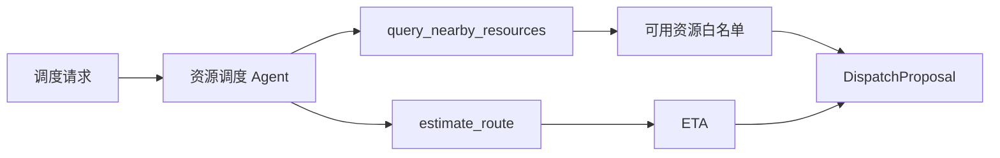
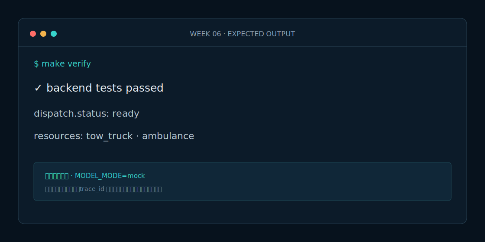

# Week 6 课程：资源调度 Agent

## 1. 本周目标

必做：独立实现资源调度 Agent；组合资源查询和路线估算 Tool；输出可审计建议与资源缺口。选做：增加按 ETA 与资源能力的多目标排序。

## 2. 必要原理

调度建议不是调度执行。Agent 只能从 Tool 返回的候选资源中选择，无法满足时必须报告缺口。确定性的 `proposal_id` 让相同请求可以安全重试，避免重复创建建议。

## 3. 架构图

## 4. 开发步骤

1. 定义请求、资源分配和建议模型。
2. 查询指定路段的全部可用资源。
3. 对每种需求选择候选并估算 ETA。
4. 排序结果、记录缺口并生成稳定 ID。

## 5. 关键代码解释

`ResourceDispatchAgent.ainvoke` 按 `required_types` 遍历；`next` 只选 `available=true` 的 Tool 数据；路线失败同样转为资源缺口。`uuid5` 使用事件和需求集合生成幂等 ID。

## 6. 预期运行结果

秦岭案例请求救护车与清障车时返回两项建议，按 ETA 升序排列；请求 `helicopter` 时返回 `status=partial` 和 `unmet_requirements=[helicopter]`，不会生成虚假资源。

## 7. 测试与评测

运行 `make eval`，断言资源引用真实率 100%、重复请求 ID 一致率 100%、不存在资源的编造率 0%。

## 8. 常见错误

- 让模型自由生成资源 ID。
- 路线 Tool 失败后仍填写猜测 ETA。
- 每次重试使用随机 proposal ID，破坏幂等。

## 9. 实战作业

只做一个作业：新增一辆不可用清障车，证明 Agent 会跳过它并选择可用候选或报告缺口。

## 10. 通关清单

- [ ] 第三个 Agent 可独立运行和评测。
- [ ] 所有资源都来自模拟 API。
- [ ] 缺口显式、ID 幂等、ETA 有来源。
- [ ] 没有真实业务副作用。

## 11. 面试题

1. 调度建议如何做到幂等？
2. 为什么 Tool 返回数据要保留来源和 trace_id？
3. 如何防止 LLM 编造资源？

## 12. 下一周衔接

下一周不增加 Agent，只把 REST Tool 迁移为可发现、可复用的 MCP 服务。
