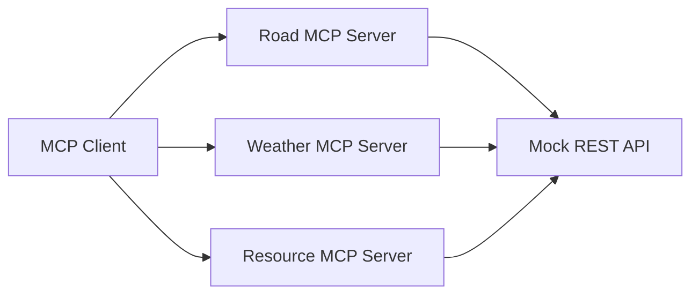
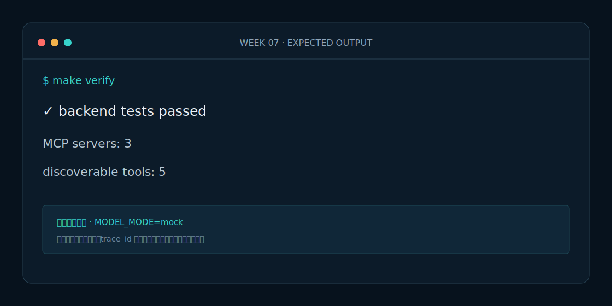

# Week 7 课程：MCP 工具服务

## 1. 本周目标

必做：理解 MCP Server、Tool Schema 和 Transport；将已有 Tool 暴露为 MCP；验证工具可发现、可调用。选做：用 MCP Inspector 连接其中一个服务。

## 2. 必要原理

REST 是业务服务的 HTTP 接口，MCP 是模型上下文与工具的标准协议。本周使用“协议适配”而非重写业务：MCP 函数调用原 `MockApiToolClient`，再把 `ToolResult` 序列化。

## 3. 架构图

## 4. 开发步骤

1. 为三类领域工具分别创建 FastMCP 工厂。
2. 注册 5 个带类型和中文描述的 Tool。
3. 复用 Tool Client 和统一序列化函数。
4. 编写启动脚本，并测试 `list_tools/call_tool`。

## 5. 关键代码解释

`create_road_server` 等工厂允许测试注入 ASGI Tool Client；生产启动脚本默认连接本地 API。返回类型为 `dict[str, Any]`，FastMCP 自动生成 JSON Schema 与结构化结果。

## 6. 预期运行结果

Road Server 可发现 `query_road_status`、`query_camera_analysis`；Weather Server 有 1 个 Tool；Resource Server 有 2 个 Tool。调用 G65/QINLING-01 路况时返回 `success=true` 和可追溯 `trace_id`。

## 7. 测试与评测

`make eval` 只评 MCP 契约：工具发现率 100%、结构化输出合法率 100%、原 REST Tool 回归测试全部通过。

## 8. 常见错误

- MCP 函数里复制业务逻辑，造成 REST 与 MCP 结果不一致。
- Tool 名称模糊，模型无法正确选择。
- 把异常堆栈直接返回给 Agent，缺少统一 error_code。

## 9. 实战作业

只做一个作业：为路况 MCP 增加一个不存在路段案例，断言返回标准错误而不是让 MCP Server 崩溃。

## 10. 通关清单

- [ ] 三个服务可分别启动。
- [ ] 5 个 Tool 均有类型和中文描述。
- [ ] MCP 与 REST 复用同一业务实现。
- [ ] 本周没有新增 Agent。

## 11. 面试题

1. MCP 与普通函数调用框架的区别是什么？
2. 为什么 MCP Server 应保持无业务状态？
3. 如何设计有利于模型选择的 Tool Schema？

## 12. 下一周衔接

下一周增加第四个专业 Agent——安全复核 Agent，统一检查证据、权限、时效和提示词注入。
