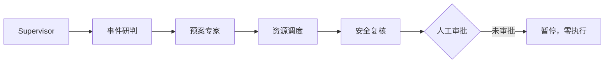
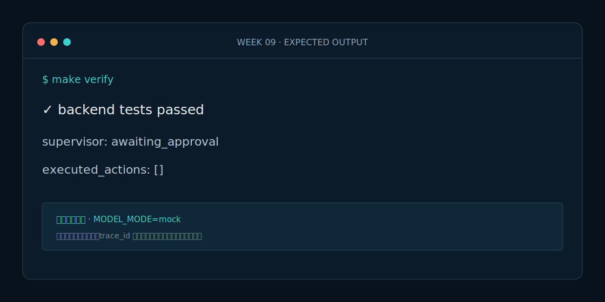

# Week 9 课程：Supervisor Agent

## 1. 本周目标

必做：在四个专业 Agent 通过独立评测后开发 Supervisor；实现有界路由、一次重试、轨迹汇总和审批边界。选做：为低风险事件增加跳过资源调度的路由测试。

## 2. 必要原理

Supervisor 是编排者，不是全能专家。它不重做研判、预案、调度或安全判断；每次调用消耗一个步骤，异常最多重试一次。建议和执行分离，Supervisor 永不直接执行高风险动作。

## 3. 架构图

## 4. 开发步骤

1. 定义统一请求、结果和路由轨迹。
2. 注入四个专业 Agent，禁止内部硬编码实例。
3. 实现最大步骤和一次异常重试。
4. 聚合结果，并把安全 BLOCK 转换为等待审批或阻断。

## 5. 关键代码解释

`_run_with_retry` 同时负责尝试计数和步数预算；成功与失败都写入 `SupervisorTrace`。`ainvoke` 只在高/严重风险且有资源需求时调用调度 Agent，最后强制经过安全复核。

## 6. 预期运行结果

秦岭烟雾案例依次出现 incident_analysis、plan_expert、resource_dispatch、safety_review，风险为 critical，资源建议 2 项，安全结果 BLOCK/HUMAN_APPROVAL_REQUIRED，最终等待人工审批且执行列表为空。

## 7. 测试与评测

运行 `make eval` 验证正常路由、失败后一次重试、两步上限停止和审批不可绕过。目标：路由顺序正确率 100%，无限循环次数 0。

## 8. 常见错误

- Supervisor 自己生成专业结论，边界失控。
- 重试没有上限或把业务拒绝当瞬时异常重试。
- 安全复核之前就执行调度动作。

## 9. 实战作业

只做一个作业：增加普通路段低风险案例，断言 Supervisor 跳过资源调度但仍经过安全复核。

## 10. 通关清单

- [ ] 前四个 Agent 仍可独立测试。
- [ ] Supervisor 有步数与重试上限。
- [ ] 每次尝试都有审计轨迹。
- [ ] 所有高风险路径都停在审批前。

## 11. 面试题

1. Supervisor 与固定工作流分别适合什么场景？
2. 如何防止多 Agent 系统无限循环？
3. 为什么错误重试和业务路由必须分开？

## 12. 下一周衔接

下一周不改 Agent 能力，只用 Vue 轻量指挥台展示输入、结果、轨迹和审批状态。
