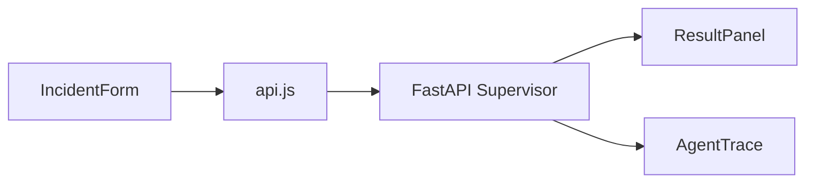
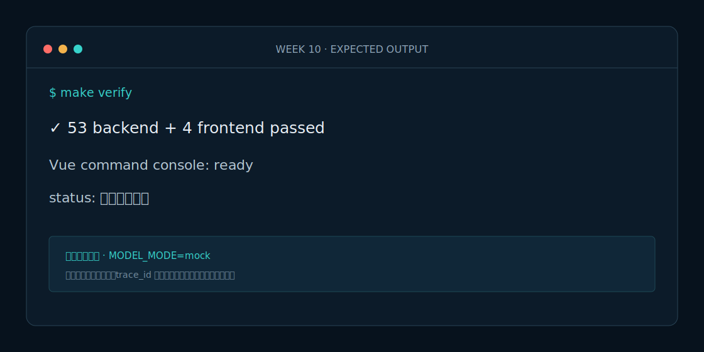

# Week 10 课程：Vue 轻量指挥台

## 1. 本周目标

必做：用 Vue 展示 Supervisor 的结构化输入输出；处理加载、成功和错误状态；展示审批边界。选做：增加“复制演示 JSON”按钮，不增加后台管理功能。

## 2. 必要原理

前端不是第二套业务逻辑。`api.js` 是唯一网络边界，组件只处理展示和交互。后端继续负责结构化校验和安全复核；前端不得把等待审批状态显示为已执行。

## 3. 架构图

## 4. 开发步骤

1. 固定 Vue、Vite、Vitest 版本并配置 `/api` 代理。
2. 先测试 `runSupervisor` 的成功和错误分支。
3. 拆分表单、结果、轨迹三个组件。
4. 加入加载/错误状态并运行生产构建。

## 5. 关键代码解释

`IncidentForm` 通过 `submit` 事件交付纯 JSON；`App.vue` 统一管理 `loading/result/error`；`ResultPanel` 使用可选链容忍部分结果；`AgentTrace` 显示每次重试而不是只显示最终状态。

## 6. 预期运行结果

默认表单提交后显示 critical 风险、预案引用数、2 项资源建议、安全 BLOCK，以及“等待人工审批”。轨迹包含四个专业 Agent，页面明确显示自动执行为 0。

## 7. 测试与评测

`make test` 同时运行 Python 与 Vitest；`make verify` 还执行 Vite 生产构建。前端验收：关键状态文字可见、API 错误可见、移动端变单列。

## 8. 常见错误

- 在多个组件分别调用 fetch，错误处理不一致。
- 只用颜色表达状态，影响可访问性。
- 组件根据原始文本自行判断风险，复制后端逻辑。

## 9. 实战作业

只做一个作业：给 ResultPanel 增加“资源缺口”列表，并用一个 `helicopter` 缺口测试验证渲染。

## 10. 通关清单

- [ ] 页面默认案例可以一键演示。
- [ ] 加载、失败、成功状态齐全。
- [ ] 审批状态与执行动作没有混淆。
- [ ] 测试和生产构建通过。

## 11. 面试题

1. 为什么前端需要单独的 API 适配层？
2. 多 Agent 轨迹应该展示哪些字段？
3. 如何避免前端与后端业务规则重复？

## 12. 下一周衔接

下一周把最终验收阈值、可靠性和安全回归做成可执行评测，并增加 Prometheus 指标。
