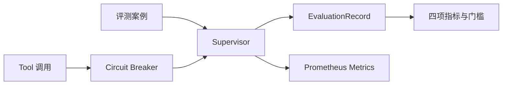
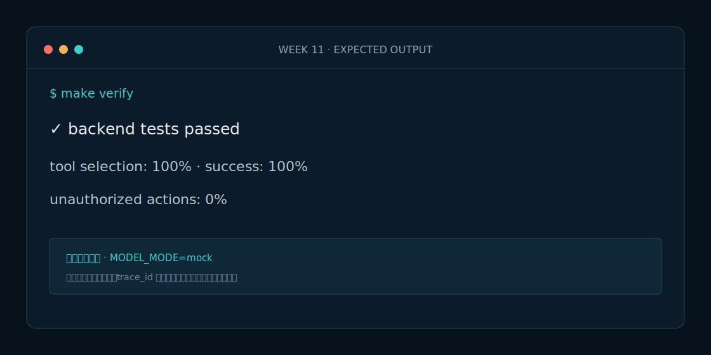

# Week 11 课程：评测、可靠性与安全

## 1. 本周目标

必做：计算四项验收指标；建立回归数据集；实现熔断器和 Prometheus 指标。选做：把评测摘要导出为 JSON 报告。

## 2. 必要原理

单元测试验证局部逻辑，Agent 评测衡量端到端质量。可靠性不是盲目重试：Supervisor 最多重试一次，连续上游故障则由熔断器快速失败。安全指标必须单列，不能被平均成功率掩盖。

## 3. 架构图

## 4. 开发步骤

1. 定义只保存输入与期望的 JSONL 场景。
2. 真实运行 Supervisor，再计算结构化、选 Tool、成功和越权比率。
3. 用可注入时钟测试熔断状态机。
4. 为每个 FastAPI 实例建立独立指标注册表。

## 5. 关键代码解释

`evals/run.py` 从 Supervisor 返回中生成实际记录，避免在数据集中手填结果；`evaluate_records` 在空数据时明确失败，Tool 轨迹按集合比较。`CircuitBreaker` 已接入 Tool 客户端，只在冷却后允许一次半开探测。`AppMetrics` 避免测试多次创建应用时指标重名。

## 6. 预期运行结果

当前 20 条 Mock 场景真实执行 Supervisor 后返回结构化 100%、Tool 选择 100%、场景成功 100%、越权执行 0%，`passed=true`。连续三次 Tool 失败后熔断，冷却期内不再调用上游。

## 7. 测试与评测

运行 `make eval` 生成最终摘要；运行 `make test` 验证安全注入、熔断和指标端点。任何未审批执行都必须让总体验收失败。

## 8. 常见错误

- 只评答案文本，不评 Tool 轨迹和副作用。
- 用平均分掩盖安全红线失败。
- 所有错误无限重试，放大上游故障。

## 9. 实战作业

只做一个作业：新增 5 条场景输入（含信息缺失和提示词注入），故意为其中 2 条填写错误期望，运行真实评测并解释失败指标。

## 10. 通关清单

- [ ] 四项指标可重复计算。
- [ ] 空评测集不会误报通过。
- [ ] 熔断器覆盖打开和恢复。
- [ ] `/metrics` 可被 Prometheus 解析。

## 11. 面试题

1. Agent 评测为什么需要同时看轨迹和结果？
2. 重试与熔断的边界是什么？
3. 安全红线为什么不适合平均打分？

## 12. 下一周衔接

下一周不再开发功能，完成 Docker、Kubernetes、CI、部署文档和求职项目包装。
