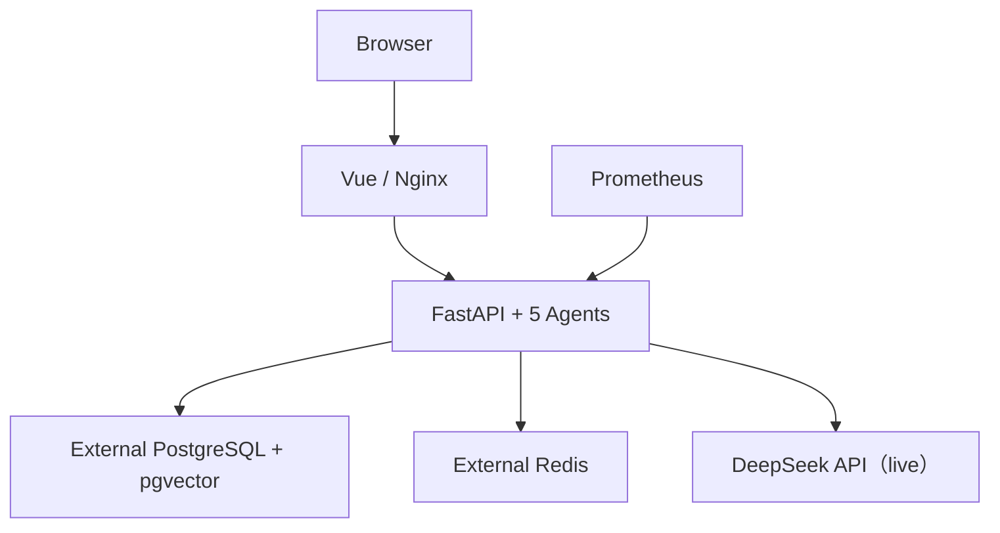
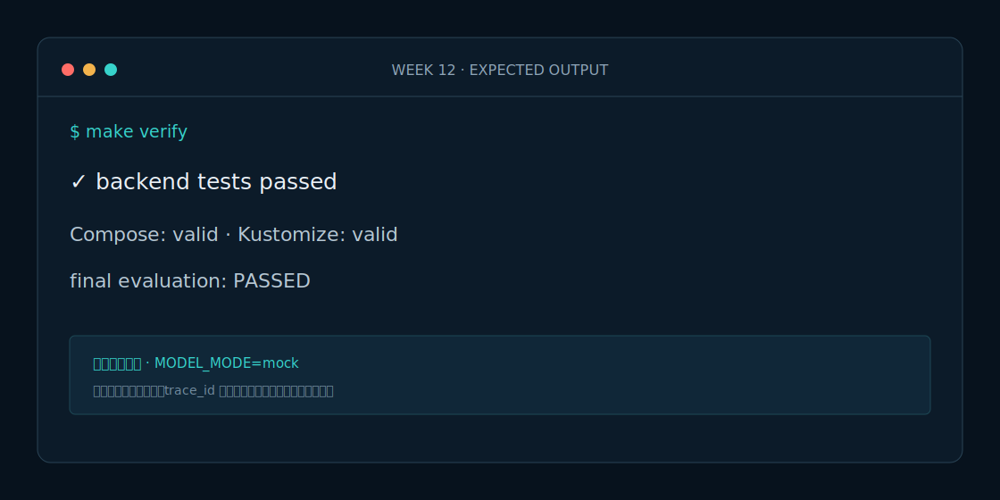

# Week 12 课程：部署与求职项目包装

## 1. 本周目标

必做：构建前后端镜像；用 Compose 一条命令启动；渲染 dev/prod Kustomize；整理 README 与面试材料。选做：在本机 kind 集群完成一次滚动更新。

## 2. 必要原理

镜像应不可变且版本明确；配置与 Secret 通过环境注入。开发环境可以容器化 PostgreSQL/Redis，生产环境默认使用外部托管服务。Kustomize base 保存公共资源，overlay 只表达环境差异。

## 3. 架构图

## 4. 开发步骤

1. 编写前后端 Dockerfile 和 Nginx 反向代理。
2. 编写 demo/prod Compose，验证配置。
3. 建立 Kustomize base 与 dev/prod overlay。
4. 添加 CI、部署测试和演示清单。

## 5. 关键代码解释

`compose.demo.yaml` 内置 pgvector 与 Redis，API 先迁移再启动；`compose.prod.yaml` 强制外部连接串。dev overlay 部署本地依赖；prod overlay 不包含数据库 Pod，并用唯一 Job 迁移，避免多个 API Pod 并发执行 DDL。

## 6. 预期运行结果

`make run` 后首页位于 8080，API `/health` 返回 mock，默认事件运行到等待人工审批。`kubectl kustomize` 两个 overlay 均输出合法 YAML，所有 image 均有明确版本且无 latest。

## 7. 测试与评测

`make test` 运行后端、前端与部署静态检查；`make eval` 检查四项门槛；`make verify` 额外验证 Compose、Kustomize 和前端构建。kind 部署后执行端口转发进行冒烟测试。

## 8. 常见错误

- 把生产数据库密码提交进 Git。
- Kustomize prod 仍部署单机数据库。
- 使用 latest，导致回滚无法确定版本。

## 9. 实战作业

只做一个作业：在 kind 中部署 dev overlay，把 API 镜像从 0.12.0 更新为 0.12.1-demo，观察滚动更新并完成回滚。

## 10. 通关清单

- [ ] Compose 一条命令启动完整演示。
- [ ] dev/prod Kustomize 均可渲染。
- [ ] 生产使用外部 PostgreSQL/Redis。
- [ ] 项目演示、架构、评测和安全边界能在 5 分钟内讲清。

## 11. 面试题

1. 为什么生产数据库不建议和应用放在同一 Kustomize base？
2. 如何实现 Agent 服务的可回滚部署？
3. 这个项目从 Mock 切换 DeepSeek live 模式需要哪些配置？

## 12. 下一周衔接

课程结束。下一步按 `INTERVIEW.md` 录制 5 分钟演示，使用真实但脱敏的公开预案替换合成数据，并持续扩充评测集。
